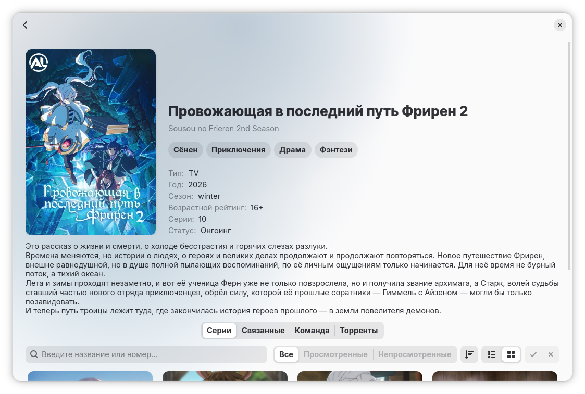

<p align="center">
  
</p>

<h1 align="center">Kitsune</h1>

<p align="center">Libadwaita client for watching anime from <a href="https://anilibria.top">AniLiberty</a></p>

<p align="center">
  <a href="https://altlinux.space/alt-gnome/Kitsune/src/branch/main/LICENSE"></a>
</p>

> Kitsune is an unofficial client. All content (catalog, descriptions, and subtitles) is provided in Russian by the [AniLiberty](https://anilibria.top) team through their public API.

## Features

- Release catalog with filters by genre, year, season, and type
- Search by title with instant results
- Release page with details, episode list, voice cast, and torrents
- Built-in video player with HLS playback and quality control
- Browse by genres and franchises
- Tags and favorites for organizing your library
- Episode watch progress tracking
- Customizable navigation — tab order and visibility
- Watch position saving
- Poster and release data caching for offline access
- Adaptive interface for desktop and mobile devices
- Russian and English language support

## Screenshots

<p align="center">
  
</p>

## Installation

### From ALT Linux repository

```sh
apt-get update
apt-get install kitsune-adw
```

### From ALS (ALT Linux Space)

```sh
apt-repo add rpm https://altlinux.space/api/packages/armatik/alt/group/sisyphus.repo noarch classic
apt-get update
apt-get install kitsune
```

### Building from source

**Dependencies:**

- Python 3.12+
- GTK 4
- Libadwaita >= 1.6
- GStreamer >= 1.24 (with gtk4paintablesink and hlsdemux plugins)
- Libsoup 3
- Meson 1.0+
- Blueprint Compiler

**Build and install:**

```bash
meson setup _build
meson compile -C _build
sudo meson install -C _build
```

**Runtime dependencies:**

For proper video playback you also need:

- gst-plugin-gtk4
- libwebp-pixbuf-loader

## Community

- [Telegram channel](https://t.me/kitsune_linux) — news and updates
- [Telegram chat](https://t.me/kitsune_linux_chat) — discussion and support
- [Bug tracker](https://altlinux.space/alt-gnome/Kitsune/issues) — report an issue

## Contributing

Contributions in the form of fixes and improvements are welcome.

### Translation

Translations are managed through Meson:

```bash
meson compile -C _build kitsune-pot          # Update translation template
meson compile -C _build kitsune-update-po    # Update translation files
```

## AniLiberty

Kitsune is powered by content from the [AniLiberty](https://anilibria.top) team — a non-commercial project dedicated to translating and dubbing anime.

- [Website](https://anilibria.top)
- [Telegram](https://t.me/anilibria)
- [VK](https://vk.com/anilibria)
- [API documentation](https://anilibria.top/api/docs/v1)

## License

Kitsune is licensed under [GPL-3.0-or-later](LICENSE).

---

> AI tools were used during the development of this project.
